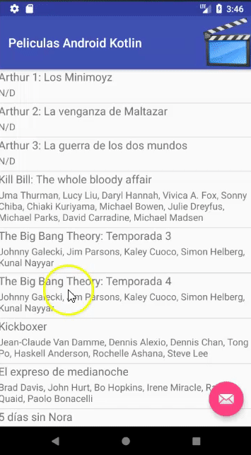

# Búsqueda de Películas en Android

Esta es una aplicación Master/Detail donde se visualizan películas disponibles de un stock.

## El proyecto
Este proyecto está generado para

* Android Studio 3.0 (Septiembre 2017)
* con Gradle 3.0.0 (el que viene con Android Studio)
* para una SDK 26 (Oreo)

## Conceptos que se ven en la app

* Uso de Activities vs. Fragment para manejar diferentes dispositivos
* Navegación entre vistas mediante el uso de Intent
* Redefinición del layout de una ListView y del detalle de una película
* Binding manual de propiedades entre objetos de dominio (Película / Genero) y objetos visuales

## Branches

* **master**: la versión simple, el repositorio es un Singleton que devuelve todos los libros
* **rest**: la versión REST la información de las películas se obtiene de un servicio REST que devuelve un JSON de películas. Hay dos versiones posibles: [XTRest](https://github.com/uqbar-project/eg-videoclub-xtrest) o [Grails](https://github.com/uqbar-project/eg-videoclub-ui-grails)

