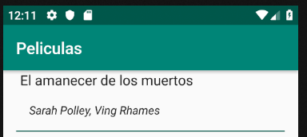
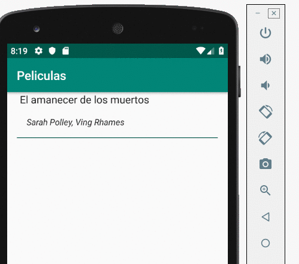
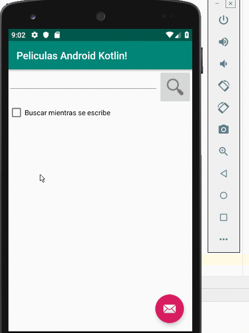

# Objetivo

- Queremos que la aplicación de películas tenga conexión con un backend remoto para obtener la lista de películas.
- Además vamos a mejorar la vista master, agregando la posibilidad de buscar las películas por un criterio, e incluso disparar una búsqueda a medida que el usuario va escribiendo

## Server

El backend puede estar construido en cualquier tecnología que

- escuche pedidos desde un puerto http/https
- cumpla con el contrato de encontrar películas a partir de un valor de búsqueda, definiendo una URL, el método http (GET en nuestro caso) y
- devuelva un json con un formato con el que tenemos que suscribir

En este caso utilizaremos la versión XTRest que pueden descargar en [https://github.com/uqbar-project/eg-videoclub-xtrest]

Y una vez levantado el servidor

```bash
$ java -jar target/videoclub-xtrest-0.0.1-SNAPSHOT-jar-with-dependencies.jar 
INFO  - log                        - Logging initialized @419ms
INFO  - Server                     - jetty-9.2.z-SNAPSHOT
INFO  - ServerConnector            - Started ServerConnector@35d176f7{HTTP/1.1}{0.0.0.0:8080}
INFO  - Server                     - Started @1035ms
```

Podemos verlo en POSTMAN o un browser:

```html
http://localhost:8080/videoclub-ui-grails-homes-xtend/peliculas/Ma
```

> TODO: Simplificar la URL

## Client

### Configuración en Android Manifest

Necesitamos configurar nuestra aplicación cliente para decirle que requerimos permisos de Internet para llegar al backend. Por otra parte, si bien hicimos el deploy del servicio REST en nuestra máquina, la aplicación cliente corre en un emulador, por lo tanto la dirección IP que debemos usar no es 127.0.0.1 sino 10.0.2.2. En el archivo `AndroidManifest.xml` agregamos los permisos de internet y externalizamos la información en un xml aparte:

```xml
<?xml version="1.0" encoding="utf-8"?>
<manifest xmlns:android="http://schemas.android.com/apk/res/android"
          package="org.uqbar.peliculasapp">

    <!-- agregamos permisos de Internet -->
    <uses-permission android:name="android.permission.INTERNET" />

    <!-- definimos networkSecurityConfig -->
    <application
            android:allowBackup="true"
            android:icon="@mipmap/ic_launcher"
            android:label="@string/app_name"
            android:roundIcon="@mipmap/ic_launcher_round"
            android:supportsRtl="true"
            android:networkSecurityConfig="@xml/network_security_config"
            android:theme="@style/AppTheme">
```

Creamos en la carpeta `res/xml` un archivo `network_security_config.xml` con la siguiente información:

```xml
<?xml version="1.0" encoding="utf-8"?>
<network-security-config>
    <domain-config cleartextTrafficPermitted="true">
        <domain includeSubdomains="true">10.0.2.2</domain>
    </domain-config>
</network-security-config>
```

### Nuevas dependencias

En el archivo `build.gradle` de nuestra app (directorio `app`) agregaremos nuevas dependencias que son necesarias para poder disparar una consulta a un servicio REST:

```gradle
dependencies {
    implementation fileTree(dir: 'libs', include: ['*.jar'])
    ...

    implementation "com.squareup.retrofit2:adapter-rxjava2:2.3.0"
    implementation 'com.squareup.retrofit2:retrofit:2.3.0'
    implementation 'com.squareup.retrofit2:converter-gson:2.3.0'
    implementation "io.reactivex.rxjava2:rxandroid:2.0.1"
}
```

Al modificar el archivo Android Studio nos muestra un cartel

> Gradle files have changed since last project sync. A project sync may be necessary for the IDE to work properly

Hacemos click en el link `Sync Now` y eso descargará las dependencias para este proyecto.

### Definición del service

Crearemos en el directorio `app/java/org.uqbar.peliculasapp/service` un archivo PeliculasService que definirá la interfaz con la que nos conectaremos al backend:

```kt
interface PeliculasService {

    @GET("peliculas/{tituloContiene}")
    fun getPeliculas(@Path("tituloContiene") tituloContiene: String): Call<List<Pelicula>>

}
```

Aquí definimos

- la URL relativa al path base
- qué parámetros debe interpolar: tituloContiene
- y qué devuelve la llamada asincrónica con **Call**. También podríamos utilizar la interfaz **Observable** como en el ejemplo [Hola mundo REST](https://github.com/uqbar-project/eg-hola-mundo-android-kotlin)

### Llamada al backend

En la vista `PeliculaListActivity` definiremos una referencia al servicio:

```kt
class PeliculaListActivity : AppCompatActivity() {

    private var peliculaService: PeliculasService? = null

    init {
        defineBackendService()
    }
```

En un método aparte inicializamos la referencia:

```kt
    fun defineBackendService() {
        // Esta URL apunta al proyecto con ORM de Grails
        // 		val API_URL = "http://10.0.2.2:8080/videoclub-ui-orm-grails"
        // Esta URL apunta a la solución en Grails con Homes hechos en Xtend
        //String SERVER_IP = "10.0.2.2";

        // IMPORTANTE
        // Por un bug de retrofit 2.0, la BASE_URL debe tener una / al final
        // y la dirección del service debe comenzar sin /, como un path relativo
        val BASE_URL = "http://10.0.2.2:8080/videoclub-ui-grails-homes-xtend/"

        val retrofit = Retrofit.Builder()
            .baseUrl(BASE_URL)
            .addConverterFactory(GsonConverterFactory.create())
            .build()

        peliculaService = retrofit.create<PeliculasService>(PeliculasService::class.java)
    }
```

Ahora sí podemos disparar la búsqueda cuando se crea la vista:

```kt
    private fun setupRecyclerView(recyclerView: RecyclerView) {
        val titulo = "Ma"

        val peliculaCall = peliculaService!!.getPeliculas(titulo)

        peliculaCall.enqueue(object : Callback<List<Pelicula>> {
            override fun onResponse(call: Call<List<Pelicula>>, response: Response<List<Pelicula>>) {
                val peliculas = response.body()

                recyclerView.adapter = PeliculaAdapter(
                    this@PeliculaListActivity,
                    peliculas ?: ArrayList(),
                    twoPane
                )

            }

            override fun onFailure(call: Call<List<Pelicula>>, t: Throwable) {
                t.printStackTrace()
                Log.e("PeliculasApp", t.message)
            }
        })

    }
```

Como creamos una _inner class_, para poder pasarle la referencia a PeliculaListActivity como `this`, tenemos que agregarle `@PeliculaListActivity` (ya que `this` dentro del contexto del método onResponse hace referencia a la clase anónima que implementa la interfaz `Callback<List<Pelicula>>`).

Disparamos la búsqueda y... nada mal:



Aunque si hacemos click sobre el elemento, veremos otra película. Claro, tenemos que cambiar también la búsqueda que hacemos en la vista detalle.

## Navegación a la vista detalle

En la versión que utilizaba el repositorio local, la vista master se comunicaba con la vista detalle mediante el identificador, porque no era costoso recuperar la película. Ahora que tenemos que llamar al backend, vamos a pasar directamente el objeto película desde la vista hacia el detalle. En la clase `PeliculaListActivity` escribimos:

```kt
        init {
            onClickListener = View.OnClickListener { v ->
                val pelicula = v.tag as Pelicula
                if (twoPane) {
                    val fragment = PeliculaDetailFragment().apply {
                        arguments = Bundle().apply {
                            putSerializable(PeliculaDetailFragment.ARG_ITEM_ID, pelicula)
                            // <-- reemplazamos putString por putSerializable
                        }
                    }
                    parentActivity.supportFragmentManager
                        .beginTransaction()
                        .replace(R.id.pelicula_detail_container, fragment)
                        .commit()
                } else {
                    val intent = Intent(v.context, PeliculaDetailActivity::class.java).apply {
                        putExtra(PeliculaDetailFragment.ARG_ITEM_ID, pelicula)
                            // <-- putExtra acepta un valor serializable
                    }
                    v.context.startActivity(intent)
                }
            }
        }
```

A su vez, la vista detalle ya no necesita llamar al repositorio. En `PeliculaDetailFragment` modificamos el comportamiento para la tablet:

```kt
    override fun onCreate(savedInstanceState: Bundle?) {
        super.onCreate(savedInstanceState)

        arguments?.let {
            if (it.containsKey(ARG_ITEM_ID)) {
                // item = RepoPeliculas.getPelicula(it.getString(ARG_ITEM_ID)!!.toLong())
                // se reemplaza por
                item = it.getSerializable(ARG_ITEM_ID) as Pelicula
```

Y en `PeliculaDetailActivity` modificamos el comportamiento para el celular, en lugar de

```kt
        if (savedInstanceState == null) {
            val fragment = PeliculaDetailFragment().apply {
                arguments = Bundle().apply {
                    putString(
                        PeliculaDetailFragment.ARG_ITEM_ID,
                        intent.getStringExtra(PeliculaDetailFragment.ARG_ITEM_ID)
                    )
                }
            }
```

trabajamos con serializables:

```kt
        if (savedInstanceState == null) {
            val fragment = PeliculaDetailFragment().apply {
                arguments = Bundle().apply {
                    putSerializable(
                        PeliculaDetailFragment.ARG_ITEM_ID,
                        intent.getSerializableExtra(PeliculaDetailFragment.ARG_ITEM_ID)
                    )
                }
            }
```

Solo un ajuste más, como tenemos un género nuevo que no existe tenemos que cambiar esta línea de la clase `GeneroAdapter`:

```kt
    fun getIconoGenero(pelicula: Pelicula): Int {
        val result = mapaGeneros[pelicula.descripcionGenero]!!
```

que provoca que cuando no encontremos un género en el mapa explote con un `NullPointerException` de Kotlin, por un [Elvis operator](https://en.wikipedia.org/wiki/Elvis_operator) que le asigne 0 a result.

```kt
    fun getIconoGenero(pelicula: Pelicula): Int {
        val result = mapaGeneros[pelicula.descripcionGenero] ?: 0
```

Ahora sí vemos el detalle de una película:



## Mejoras a la búsqueda

Por el momento estamos _hardcodeando_ el valor de búsqueda a "Ma", pero vamos a permitir que el usuario ingrese un valor y presione el botón Buscar, o bien vamos a habilitar la búsqueda a medida que el usuario escribe. Para ello, tenemos que incorporar en la vista master:

- un texto
- un botón para disparar la búsqueda
- un checkbox que habilita la búsqueda

En el archivo `pelicula_list.xml` agregamos estos controles:

```xml
<LinearLayout
        xmlns:android="http://schemas.android.com/apk/res/android"
        android:layout_width="match_parent"
        android:layout_height="match_parent"
        android:orientation="vertical">

    <LinearLayout
            android:layout_width="match_parent"
            android:layout_height="wrap_content"
            android:orientation="horizontal">

        <EditText
                android:id="@+id/tituloContiene"
                android:layout_width="wrap_content"
                android:layout_height="wrap_content"
                android:inputType="text"
                android:ems="14"/>

        <ImageButton
                android:id="@+id/btnBuscar"
                android:layout_width="wrap_content"
                android:layout_height="wrap_content"
                android:contentDescription="@string/buscar"
                android:onClick="buscarPeliculas"
                android:src="@drawable/ic_action_search"/>
    </LinearLayout>

    <CheckBox
            android:id="@+id/chkBuscarOnline"
            android:layout_width="wrap_content"
            android:layout_height="wrap_content"
            android:text="@string/buscarInmediatamente"
    />

    <android.support.v7.widget.RecyclerView xmlns:android="http://schemas.android.com/apk/res/android"
```

Y además en la clase `PeliculaListActivity` tenemos que incorporar varias cosas:

- el EditText tituloContiene tendrá un observer que escuchará los cambios que haga el usuario. Si el checkbox está desactivado no tendrá efecto, en caso contrario cuando supere los 2 caracteres disparará la búsqueda
- además el checkbox cuando se activa invisibiliza el botón Buscar, porque la búsqueda se produce automáticamente
- el botón Buscar dispara la búsqueda, para lo cual `PeliculaListActivity` se registra como observer del botón
- reemplazamos el método setupRecyclerView por buscarPeliculas() que es más representativo de lo que hace, sabiendo además que podemos acceder directamente al RecyclerView llamado peliculas_list que define la actividad principal

```kt
class PeliculaListActivity : AppCompatActivity(), View.OnClickListener {
    ...
    private val MIN_BUSQUEDA_PELICULAS = 2

    ...
    override fun onCreate(savedInstanceState: Bundle?) {
        ...

        // Comportamiento del checkbox que indica si se busca a medida que se escribe
        val chkBuscar = this.chkBuscarOnline as CheckBox
        chkBuscar.setOnClickListener {
            val btnBuscar = this.btnBuscar as ImageButton
            if (chkBuscar.isChecked) {
                btnBuscar.visibility = View.INVISIBLE
            } else {
                btnBuscar.visibility = View.VISIBLE
            }
        }

        // Comportamiento del título de búsqueda
        tituloContiene.addTextChangedListener(object : TextWatcher {
            override fun beforeTextChanged(s: CharSequence, start: Int, count: Int, after: Int) {}

            override fun onTextChanged(s: CharSequence, start: Int, before: Int, count: Int) {}

            override fun afterTextChanged(editable: Editable) {
                if (chkBuscar.isChecked && editable.length >= MIN_BUSQUEDA_PELICULAS) {
                    buscarPeliculas()
                }
            }
        })

        this.btnBuscar.setOnClickListener(this)
    }

    // El usuario presionó el botón Buscar, disparamos la búsqueda de películas
    override fun onClick(v: View?) {
        buscarPeliculas()
    }

    private fun buscarPeliculas() {
        val peliculaCall = peliculaService!!.getPeliculas(this.tituloContiene.text.toString())
        val parentActivity = this@PeliculaListActivity

        peliculaCall.enqueue(object : Callback<List<Pelicula>> {
            override fun onResponse(call: Call<List<Pelicula>>, response: Response<List<Pelicula>>) {
                val peliculas = response.body()

                parentActivity.pelicula_list.adapter = PeliculaAdapter(
                ...
```

## Demo final



