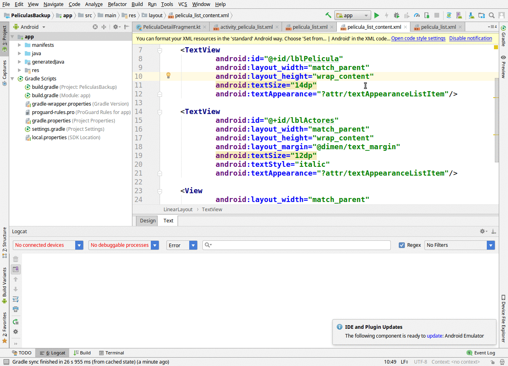

# La aplicación en distintos dispositivos

Hasta el momento hemos visto la aplicación en un emulador de un dispositivo similar al de un teléfono. ¿Qué pasa si probamos con un dispositivo más grande, una tablet, en lugar de emular un teléfono?

## Configurando un nuevo dispositivo

En el menú Tools > AVD Manager o bien al ejecutar nuestra aplicación, podemos generar un nuevo dispositivo:



A partir de aquí, podemos emular una tablet o un celular, con resultados diferentes.

## Vista específica para tablets

Al crear una vista master/detail tenemos una vista `pelicula_list (w900dp)` para dispositivos de más de 900 dp:

```xml
<?xml version="1.0" encoding="utf-8"?>
<LinearLayout xmlns:android="http://schemas.android.com/apk/res/android"
              xmlns:app="http://schemas.android.com/apk/res-auto"
              xmlns:tools="http://schemas.android.com/tools"
              android:layout_width="match_parent"
              android:layout_height="match_parent"
              android:layout_marginLeft="16dp"
              android:layout_marginRight="16dp"
              android:baselineAligned="false"
              android:divider="?android:attr/dividerHorizontal"
              android:orientation="horizontal"
              android:showDividers="middle"
              tools:context=".PeliculaListActivity">

    <!--
    This layout is a two-pane layout for the Peliculas
    master/detail flow.
    
    -->

    <android.support.v7.widget.RecyclerView xmlns:android="http://schemas.android.com/apk/res/android"
            .../>

    <FrameLayout
            android:id="@+id/pelicula_detail_container"
            android:layout_width="0dp"
            android:layout_height="match_parent"
            android:layout_weight="3"/>

</LinearLayout>
```

En esta vista vemos que hay dos elementos dispuestos en un layout horizontal (uno al lado del otro):

* el primero referencia a la lista de películas (PeliculaListActivity)
* el segundo es un contenedor cuyo identificador es `pelicula_detail_container`

