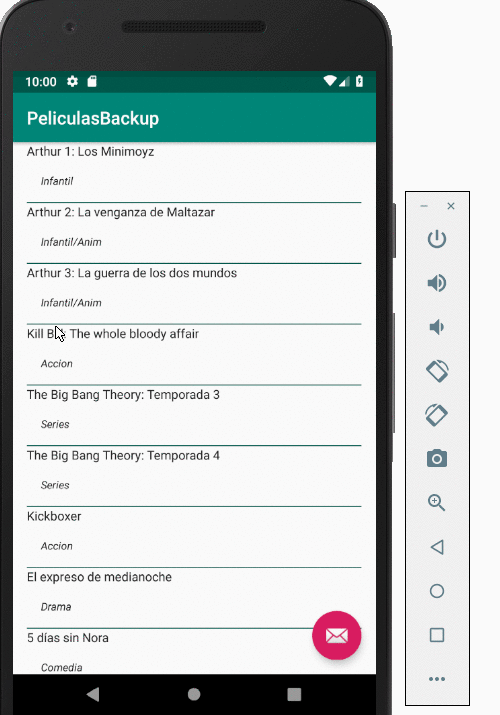

# Objetivo

Tenemos por el momento una aplicación que muestra una lista de películas, queremos acceder a la información detallada de una película.

¿Cómo navegamos la aplicación para ver el detalle? Una opción es

* en la lista, incorporar la acción mediante un botón o link
* al hacer click sobre un elemento, navegamos a la vista de detalle

Elegimos la segunda opción, porque la primera fuerza a repetir las acciones para cada línea y eso nos quita espacio para mostrar más info de una película.

# User Experience

Estas decisiones forman parte de la “experiencia de usuario” o UX por sus siglas en inglés, User eXperience. La parte visual juega un papel muy importante en el desarrollo de este tipo de aplicaciones, donde podemos

* respetar el comportamiento que tienen las otras aplicaciones Android o el sistema operativo sobre el que estemos desarrollando, con la ventaja de que estamos construyendo aplicaciones nativas y no híbridas
* salirnos del esquema y trabajar de una única manera en la aplicación independientemente del dispositivo / tecnología en el que corra. Esta estrategia es válida si nuestra intención es que los usuarios puedan cambiar de aparato, sistema operativo, etc. sin notar cambios en la manipulación de la aplicación, pero sugiere un período de adaptación del usuario a nuestra aplicación, por lo que hay que invertir tiempo en que sea lo suficientemente intuitiva y permita la menor cantidad de desplazamientos, algo que en las aplicaciones “tradicionales” de escritorio o web no era una variable de tanto peso.

Dejamos algunas lecturas recomendadas:

* http://www.usability.gov/what-and-why/user-experience.html
* http://developer.android.com/design/patterns/navigation.html
* http://developer.android.com/design/patterns/navigation-drawer.html

# Pasaje de información entre actividades

Cuando creamos un proyecto de tipo Master/Detail, el IDE nos generó varias líneas que se encargan de resolver este tema. Ahora vamos a estudiarlo para saber cómo funciona y ver si es necesario hacer algún ajuste. Primero que nada tenemos que ver cómo le llega la información desde la actividad Lista hacia la Detalle, en la clase SimpleItemRecyclerViewAdapter que está en PeliculaListActivity. Dicha clase tiene un observer sobre los elementos de la list view, definido por la variable `onClickListener` y se inicializa de la siguiente manera:

```kt
private val onClickListener: View.OnClickListener

init {
    onClickListener = View.OnClickListener { v ->
        val item = v.tag as DummyContent.DummyItem
        if (twoPane) {
            val fragment = PeliculaDetailFragment().apply {
                arguments = Bundle().apply {
                    putString(PeliculaDetailFragment.ARG_ITEM_ID, item.id)
                }
            }
            parentActivity.supportFragmentManager
                .beginTransaction()
                .replace(R.id.pelicula_detail_container, fragment)
                .commit()
        } else {
            val intent = Intent(v.context, PeliculaDetailActivity::class.java).apply {
                putExtra(PeliculaDetailFragment.ARG_ITEM_ID, item.id)
            }
            v.context.startActivity(intent)
        }
    }
}
```

Antes de hablar de la navegación, estudiemos qué información estamos queriendo tomar para identificar la película que el usuario seleccionó, puede ser

* la posición del elemento
* el identificador de la película
* un objeto película

¿Qué es lo que resultaría más cómodo? Uno podría valorar a priori tener un objeto película, pero hay que tener en cuenta que la lista de películas puede hacerse mediante un servicio REST, que quizás no nos entregue toda la información de la película, sino que use una representación en json reducida, para bajar la cantidad de datos a transmitir. Aún así, podríamos utilizar a la película como abstracción entre la vista master y la vista detalle, teniendo en cuenta que será necesario una nueva búsqueda para traer la información completa de una película.

# Navegación

Si miramos nuevamente el método en , vemos que hay un if:

```kt
init {
    onClickListener = View.OnClickListener { v ->
        val item = v.tag as DummyContent.DummyItem
        if (twoPane) {
            ...
        } else {
            ...
        }
    }
}
```

_PeliculaListActivity.kt_

Esta división se da porque

* si estamos testeando la aplicación con un dispositivo cuyo tamaño nos permite unificar en una sola actividad el fragmento lista y el detalle, estamos en modo **two-pane**. Más adelante estudiaremos su comportamiento.
* los dispositivos como el teléfono, que tienen una pantalla de tamaño chico, trabajan en modo single-pane, entonces hay que navegar hacia la vista de detalle.

Nos concentraremos por el momento en la solución **single-pane**, que crea la navegación hacia la vista detalle mediante el concepto Intent, una abstracción que representa cualquier tipo de operación. El intent define un método putExtra donde pasamos parámetros de una actividad a otra, en este caso el id de la película seleccionada.

En la actividad de detalle recibimos el id y se lo pasamos al fragment:

```kt
class PeliculaDetailActivity : AppCompatActivity() {

    override fun onCreate(savedInstanceState: Bundle?) {
        ...
        if (savedInstanceState == null) {
            // Create the detail fragment and add it to the activity
            // using a fragment transaction.
            val fragment = PeliculaDetailFragment().apply {
                arguments = Bundle().apply {
                    putString(
                        PeliculaDetailFragment.ARG_ITEM_ID,
                        intent.getStringExtra(PeliculaDetailFragment.ARG_ITEM_ID)
                    )
                }
            }

            supportFragmentManager.beginTransaction()
                .add(R.id.pelicula_detail_container, fragment)
                .commit()
        }
    }
```

En el fragment lo transformamos en un objeto película para mostrar la información de dicha película. Reemplazamos 

```kt
class PeliculaDetailFragment : Fragment() {

    /**
     * The dummy content this fragment is presenting.
     */
    private var item: DummyContent.DummyItem? = null
```

por 

```kt
    private var item: Pelicula? = null
```

Y también tenemos que obtener el objeto película en base al id, delegando en el repo:

```kt
    override fun onCreate(savedInstanceState: Bundle?) {
        super.onCreate(savedInstanceState)

        arguments?.let {
            if (it.containsKey(ARG_ITEM_ID)) {
                // Load the dummy content specified by the fragment
                // arguments. In a real-world scenario, use a Loader
                // to load content from a content provider.
                item = RepoPeliculas.getPelicula(it.getString(ARG_ITEM_ID)!!.toLong())
                activity?.toolbar_layout?.title = item?.titulo
            }
        }
    }
```

Entonces

* tomamos de los argumentos el ARG_ITEM_ID que tiene como string el id de la película
* forzamos con el operador `!!` a que [no pueda ser nulo](https://kotlinlang.org/docs/reference/null-safety.html) para convertirlo a Long
* luego le pasamos el id al repo y tenemos la película
* para mostrar su título en la toolbar de la vista de detalle

Para terminar de corregir lo que falta, en el método onCreateView vamos a mostrar la sinopsis de la película:

```kt
    override fun onCreateView(
        inflater: LayoutInflater, container: ViewGroup?,
        savedInstanceState: Bundle?
    ): View? {
        val rootView = inflater.inflate(R.layout.pelicula_detail, container, false)

        // Show the dummy content as text in a TextView.
        item?.let {
            rootView.pelicula_detail.text = it.sinopsis // <-- fix
        }
```

Y por último, en PeliculaListActivity debemos modificar la inicialización de la clase SimpleItemRecyclerViewAdapter para castear correctamente a un objeto película, y guardar el id como string:

```kt
    init {
        onClickListener = View.OnClickListener { v ->
            val item = v.tag as Pelicula <-- casteamos a Pelicula
            if (twoPane) {
                val fragment = PeliculaDetailFragment().apply {
                    arguments = Bundle().apply {
                        putString(PeliculaDetailFragment.ARG_ITEM_ID, item.id.toString()) <-- pasamos a String
                    }
                }
                parentActivity.supportFragmentManager
                    .beginTransaction()
                    .replace(R.id.pelicula_detail_container, fragment)
                    .commit()
            } else {
                val intent = Intent(v.context, PeliculaDetailActivity::class.java).apply {
                    putExtra(PeliculaDetailFragment.ARG_ITEM_ID, item.id.toString()) <--- pasamos a String
```

Vemos ahora sí cómo funciona la navegación de la vista master a la detalle:



