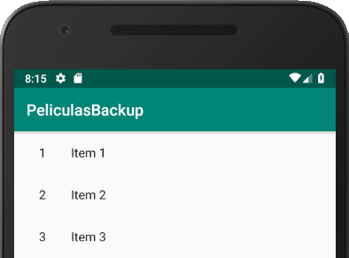
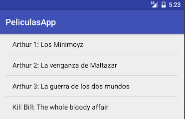
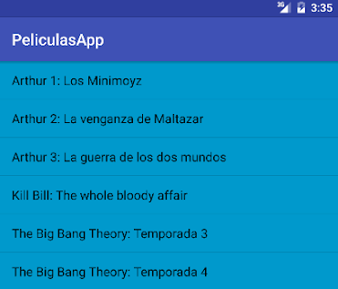
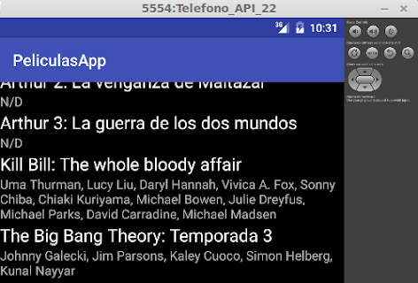
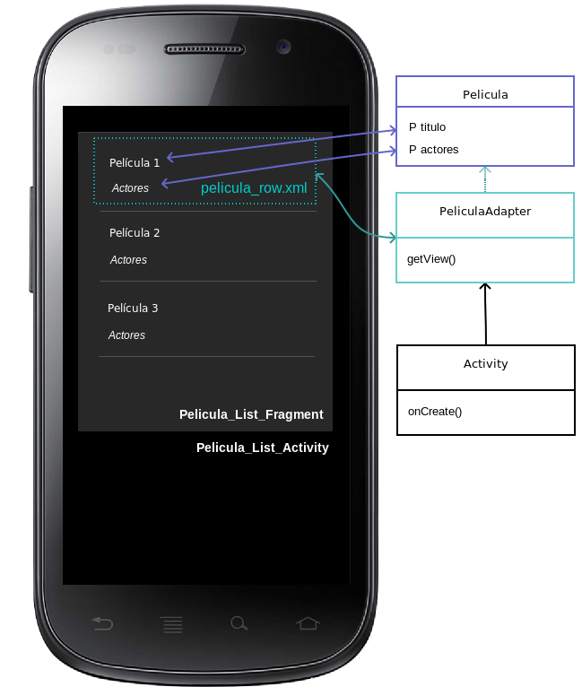

# Master-Detail. Ventana master. List View con layout default y custom

## El ejemplo

Queremos visualizar una lista de películas y al hacer click sobre una nos interesa ver su información completa.

## Crear un proyecto Master/Detail

Generamos un nuevo proyecto: File > New > New Project... elegimos un nombre representativo "PeliculasApp", el company name. Luego elegimos el dispositivo destino (Phone and Tablet).

Entonces elegimos como tipo de proyecto un "Master / Detail Flow" y configuramos:

* Object Kind: "Pelicula"
* Object Kind Plural: "Peliculas"
* Title: "Películas"

## Activities y Fragments

Al finalizar la actividad, vemos que se generaron 4 vistas:

* PeliculaListActivity
* PeliculaListFragment
* PeliculaDetailActivity
* PeliculaDetailFragment

El fragment permite bajar la granularidad de la actividad en partes más pequeñas. La activity puede contener uno o más fragments. De esa manera podemos trabajar los componentes visuales de diferente manera para un smartphone o una tablet. Por el momento sabemos que

* la activity PeliculaList define
  * el título,
  * los action buttons, en principio ninguno,
  * y la navegación. Por el momento pensemos en una aplicación para smartphones, entonces la navegación consistiría en que cuando el usuario selecciona una película eso dispara una actividad nueva donde se muestra el detalle de la película (PeliculaDetailActivity + PeliculaDetailFragment). [Más adelante](./activitiesFragmentsDispositivos.md) veremos que esta separación actividad / fragmento permite combinarlos para diferentes dispositivos.
* el fragment PeliculaList define la vista con la lista de películas

## Lista de Películas

De movida podemos ejecutar la aplicación gracias a todo el código [boilerplate](https://www.google.com/url?q=https%3A%2F%2Fen.wikipedia.org%2Fwiki%2FBoilerplate_code&sa=D&sntz=1&usg=AFQjCNEq3kj_eHxD1mqda7LsxRzpQk1LEw) generado:



La lista se define en la `activity_peliculas_list.xml`:

```xml
<?xml version="1.0" encoding="utf-8"?>
<LinearLayout
    xmlns:android="http://schemas.android.com/apk/res/android"
    android:layout_width="match_parent"
    android:layout_height="match_parent"
    android:orientation="vertical" >

    <fragment
        android:id="@+id/fragment1"
        android:name="org.uqbar.peliculasapp.PeliculaListFragment"
        android:layout_width="match_parent"
        android:layout_height="match_parent" />

</LinearLayout>
```

_activity_peliculas_list.xml_

El layout default es list_content, que tiene una [ListView](https://developer.android.com/guide/topics/ui/layout/listview.html).

¿Dónde se llena la lista de elementos de la ListView? En el Fragment de la lista de películas, que extiende especialmente de ListFragment:

```kt
class PeliculaListFragment : ListFragment() {
```

Y específicamente en el método onCreate:

```kt
override fun onCreate(savedInstanceState: Bundle) {
    val peliculas = RepoPeliculas.instance.getPeliculas(null, 10)
    super.onCreate(savedInstanceState)
    listAdapter = new ArrayAdapter<DummyContent.DummyItem>(
        getActivity(),
        android.R.layout.simple_list_item_activated_1,
        android.R.id.text1,
        DummyContent.ITEMS)
}
```

Reemplazamos entonces DummyContents.ITEMS por una lista de películas de un Repositorio creado para la ocasión:

```kt
override fun onCreate(savedInstanceState: Bundle) {
    val peliculas = RepoPeliculas.instance.getPeliculas(null, 10)
    super.onCreate(savedInstanceState)
    listAdapter = PeliculaAdapter(
            activity as Context,
            peliculas)
}
```

En esta versión muy sencilla, cada línea muestra el toString() redefinido en película:



(pueden probar cambiar el método toString() en Pelicula).

## Otra variante

Podemos construir nuestro propio fragmento custom, para lo cual hacemos algunos cambios:

En la actividad reemplazamos al fragmento con el layout predefinido por un fragment incluido en un Linear Layout:

```xml
<?xml version="1.0" encoding="utf-8"?>
<LinearLayout
    xmlns:android="http://schemas.android.com/apk/res/android"
    android:layout_width="match_parent"
    android:layout_height="match_parent"
    android:orientation="vertical" >

    <fragment
        android:id="@+id/fragment1"
        android:name="org.uqbar.peliculas.PeliculaListFragment"
        android:layout_width="match_parent"
        android:layout_height="match_parent" />

</LinearLayout>
```

_activity_pelicula_list.xml_

En un xml separado definimos el layout del fragmento:

```xml
<?xml version="1.0" encoding="utf-8"?>
<LinearLayout
    xmlns:android="http://schemas.android.com/apk/res/android"
    android:layout_width="match_parent"
    android:layout_height="match_parent"
    android:orientation="vertical" >
    <ListView
           android:id="@android:id/list"
           android:background="@android:color/holo_blue_dark"
           android:layout_width="match_parent"
           android:layout_height="wrap_content" >
    </ListView>
    <TextView
           android:id="@android:id/empty"
           android:layout_width="match_parent"
           android:layout_height="wrap_content" >
   </TextView>
</LinearLayout>
```

pelicula_list_fragment.xml

El ListView tiene la propiedad background en azul sólo por fines didácticos.

Para poder utilizar esta vista en el fragment, tenemos que "inflar" (bindear) el layout en el código del Fragment:

```kt
override fun onCreateView(inflater: LayoutInflater, container: ViewGroup?, savedInstanceState: Bundle): View {
    return inflater!!.inflate(R.layout.pelicula_list_fragment, null, false)
}
```

_PeliculaListFragment.xml_

Visualizamos el cambio:



## Layout custom con dos filas

Vamos a modificar el layout default para mostrar 2 filas:

* en la primera mostramos el título de la película con un tamaño grande
* en la segunda se visualiza la lista de actores

Qué tenemos que hacer

* definir un layout específico para cada fila que va a reemplazar el layout default: esto es un xml
* generar un adapter, para "inflar" el layout custom de cada ítem: esto es código Java que recibe la lista de películas y transforma cada fila
* y en el Controller (ListFragment) reemplazar el ArrayAdapter de películas default por el nuevo adapter 

## Layout específico

Definimos el layout con dos filas, cada una con un TextView que muestra todo el contenido del texto:

```xml
<?xml version="1.0" encoding="utf-8"?>
<LinearLayout xmlns:android="http://schemas.android.com/apk/res/android"
    android:orientation="vertical"
    android:layout_width="match_parent"
    android:layout_height="match_parent">
    <TextView
        android:id="@+id/lblPelicula"
        android:layout_width="wrap_content"
        android:layout_height="wrap_content"
        android:text="@+id/label"         android:textAppearance="@android:style/TextAppearance.DeviceDefault.Large.Inverse">  
    </TextView>
    <TextView
        android:id="@+id/lblActores"
        android:layout_width="wrap_content"
        android:layout_height="wrap_content"
        android:text="@+id/label"
        android:textSize="40px"        android:textAppearance="@android:style/TextAppearance.DeviceDefault.Medium.Inverse">
    </TextView>  
</LinearLayout>
```

_pelicula_row.xml_

Los textos se visualizan en inversa, porque vamos a cambiar el color de fondo del List View a negro:

```xml
<ListView
    android:id="@android:id/list"
    android:background="@android:color/black"
    android:layout_width="match_parent"
    android:layout_height="wrap_content">
</ListView>
```

_pelicula_list_fragment.xml_

## Adapter de películas

PeliculaAdapter hereda de ArrayAdapter, aunque también hay otras variantes: BaseAdapter o SimpleAdapter.

Veamos el constructor del adapter...

```kt
class PeliculaAdapter(context: Context, peliculas: List<Pelicula>) : ArrayAdapter<Pelicula>(context, R.layout.pelicula_row, peliculas) {
```

Es importante respetar algunas cosas:

* el context suele ser la actividad en la que está contenido el ListView
* asociamos como formato la fila anteriormente definida: R.layout.pelicula_row
* el tercer parámetro (la lista de películas) es muy importante pasarlo al constructor de la superclase. De lo contrario la list view quedará vacía, por más que almacenemos el argumento peliculas en una variable de instancia.

Ahora sí por cada uno de los elementos se invoca al método getView, donde se arma el binding entre el row y los valores de cada película:

```kt
override fun getView(position: Int, convertView: View, parent: ViewGroup): View {
    val inflater = context
            .getSystemService(Context.LAYOUT_INFLATER_SERVICE) as LayoutInflater
    val rowView = inflater.inflate(R.layout.pelicula_row, parent, false)
    val pelicula = getItem(position)

    rowView.lblPelicula.setText(pelicula.toString())
    rowView.lblActores.setText(pelicula.actores.toString())
    return rowView
}
```

El modelo que propone Android y el lenguaje Java no nos ayudan para bajar la cantidad de líneas que necesitamos, pero creemos que se entiende el concepto.

Reemplazar el Adapter en el Fragment

Sólo nos falta reemplazar el ArrayAdapter por nuestro PeliculaAdapter, en el _PeliculaListFragment_:

```kt
override fun onCreate(savedInstanceState: Bundle?) {
    val peliculas = RepoPeliculas.instance.getPeliculas(null, 10)
    super.onCreate(savedInstanceState)
    listAdapter = PeliculaAdapter(
            activity as Context,
            peliculas)
}
```

Y ahora sí, podemos ver el cambio al reiniciar la aplicación:



