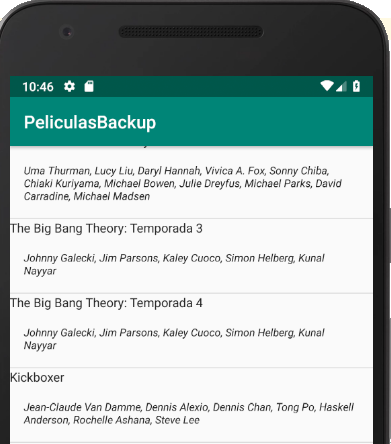

# Master-Detail. Ventana master. List View con layout default y custom

## El ejemplo

Queremos visualizar una lista de películas y al hacer click sobre una nos interesa ver su información completa.

## Crear un proyecto Master/Detail


Generamos un nuevo proyecto: File > New > New Project... elegimos un nombre representativo "PeliculasApp", el company name. Luego elegimos el dispositivo destino (Phone and Tablet).

Entonces elegimos como tipo de proyecto un "Master / Detail Flow" y configuramos:

* Object Kind: "Pelicula"
* Object Kind Plural: "Peliculas"
* Title: "Películas"

## Activities y Fragments

Al finalizar la actividad, vemos que se generaron 4 vistas:

* PeliculaListActivity
* PeliculaListFragment
* PeliculaDetailActivity
* PeliculaDetailFragment

El fragment permite bajar la granularidad de la actividad en partes más pequeñas. La activity puede contener uno o más fragments. De esa manera podemos trabajar los componentes visuales de diferente manera para un smartphone o una tablet. Por el momento sabemos que

* la activity PeliculaList define
  * el título,
  * los action buttons, en principio ninguno,
  * y la navegación. Por el momento pensemos en una aplicación para smartphones, entonces la navegación consistiría en que cuando el usuario selecciona una película eso dispara una actividad nueva donde se muestra el detalle de la película (PeliculaDetailActivity + PeliculaDetailFragment). [Más adelante](./activitiesFragmentsDispositivos.md) veremos que esta separación actividad / fragmento permite combinarlos para diferentes dispositivos.
* el fragment PeliculaList define la vista con la lista de películas

## Lista de Películas

De movida podemos ejecutar la aplicación gracias a todo el código [boilerplate](https://www.google.com/url?q=https%3A%2F%2Fen.wikipedia.org%2Fwiki%2FBoilerplate_code&sa=D&sntz=1&usg=AFQjCNEq3kj_eHxD1mqda7LsxRzpQk1LEw) generado:


Solo hay que corregir un pequeño detalle, en la clase `PeliculaDetailFragment.kt`, dentro del método onCreate:

```kt
override fun onCreate(savedInstanceState: Bundle?) {
    super.onCreate(savedInstanceState)

    arguments?.let {
        if (it.containsKey(ARG_ITEM_ID)) {
            // así está
            // item = DummyContent.ITEM_MAP[it.getString(ARG_ITEM_ID)]
            // así la cambiamos
            item = DummyContent.ITEM_MAP[it.getString(ARG_ITEM_ID)!!]
            activity?.toolbar_layout?.title = item?.content
        }
    }
}
```

Después explicaremos en detalle cómo trabaja la vista.

La lista de ítems se define en la `activity_pelicula_list.xml`:

```xml
<android.support.design.widget.CoordinatorLayout ...>
    <FrameLayout
            android:id="@+id/frameLayout"
            android:layout_width="match_parent"
            android:layout_height="match_parent"
            app:layout_behavior="@string/appbar_scrolling_view_behavior">

        <include layout="@layout/pelicula_list"/>
    </FrameLayout>
```

El archivo de include `pelicula_list.xml` contiene un **RecyclerView**:

```xml
<?xml version="1.0" encoding="utf-8"?>
<android.support.v7.widget.RecyclerView xmlns:android="http://schemas.android.com/apk/res/android"
                                        xmlns:app="http://schemas.android.com/apk/res-auto"
                                        xmlns:tools="http://schemas.android.com/tools"
                                        android:id="@+id/pelicula_list"
                                        android:name="com.example.fernando.peliculasbackup.PeliculaListFragment"
                                        android:layout_width="match_parent"
                                        android:layout_height="match_parent"
                                        android:layout_marginLeft="16dp"
                                        android:layout_marginRight="16dp"
                                        app:layoutManager="LinearLayoutManager"
                                        tools:context=".PeliculaListActivity"
                                        tools:listitem="@layout/pelicula_list_content"/>
```

Como vemos, este container define un **list item** cuyo contenido define una [ListView](https://developer.android.com/guide/topics/ui/layout/listview.html) en un archivo aparte: pelicula_list_content.xml. Sí, demasiadas indirecciones para un simple master/detail.

¿Dónde se llena la lista de elementos de la ListView? En la activity de la lista de películas:

```kt
class PeliculaListActivity : AppCompatActivity() {
```

Y específicamente en el método onCreate, se llama al método setupRecyclerView que configura nuestro container donde se encuentra la list view antes mencionada:

```kt
private fun setupRecyclerView(recyclerView: RecyclerView) {
    recyclerView.adapter = SimpleItemRecyclerViewAdapter(this, DummyContent.ITEMS, twoPane)
}
```

La clase SimpleItemRecyclerViewAdapter será la encargada de responder ante eventos de usuario como el click que permitirá navegar hacia la vista de detalle.

Reemplazamos entonces DummyContents.ITEMS por una lista de películas de un Repositorio creado para la ocasión:

```kt
private fun setupRecyclerView(recyclerView: RecyclerView) {
    recyclerView.adapter = SimpleItemRecyclerViewAdapter(this, RepoPeliculas.getPeliculas(null, 10), twoPane)
}
```

Esto requiere modificar también la clase SimpleItemRecyclerViewAdapter, para guardar una lista de películas, y los valores asociados en la list view (id y título):

```kt
class SimpleItemRecyclerViewAdapter(
    private val parentActivity: PeliculaListActivity,
    private val values: List<Pelicula>,   // <-- cambiamos el tipo de List<DummyContent.DummyItem>

    ...

    override fun onBindViewHolder(holder: ViewHolder, position: Int) {
        val item = values[position]
        holder.idView.text = item.id.toString()   // el id como String
        holder.contentView.text = item.titulo     // el título de la película o lo que deseemos
```


## Otra variante

Podemos construir nuestro propio fragmento custom, por ejemplo para mostrar

* el título de la película
* el género a la que pertenece, en cursiva

El archivo _pelicula_list_content.xml_ tiene la definición de lo que muestra cada ítem. Modificamos los id de los primeros textview por `titulo` y `genero`. También agregamos propiedades específicas para los textos (size = 14 para el título, 12 para el género, que además se visualizará en _italic_). El layout principal es Linear, pero ahora vertical. Agregamos al final una línea horizontal utilizando el color primario del tema elegido (esto permite asociarlo a la paleta de colores elegida).

```xml
<?xml version="1.0" encoding="utf-8"?>
<LinearLayout xmlns:android="http://schemas.android.com/apk/res/android"
              android:layout_width="wrap_content"
              android:layout_height="wrap_content"
              android:orientation="vertical">

    <TextView
            android:id="@+id/titulo"
            android:layout_width="match_parent"
            android:layout_height="wrap_content"
            android:textSize="14dp"
            android:textAppearance="?attr/textAppearanceListItem"/>

    <TextView
            android:id="@+id/genero"
            android:layout_width="match_parent"
            android:layout_height="wrap_content"
            android:layout_margin="@dimen/text_margin"
            android:textSize="12dp"
            android:textStyle="italic"
            android:textAppearance="?attr/textAppearanceListItem"/>

    <View
            android:layout_width="match_parent"
            android:layout_height="1dp"
            android:background="@color/colorPrimaryDark"/>

</LinearLayout>
```

Esto rompe las líneas de SimpleItemRecyclerViewAdapter:

```kt
    inner class ViewHolder(view: View) : RecyclerView.ViewHolder(view) {
        val idView: TextView = view.id_text          // NO COMPILA
        val contentView: TextView = view.content     // NO COMPILA
    }
```

Corregimos esto:

```kt
    override fun onBindViewHolder(holder: ViewHolder, position: Int) {
        val item = values[position]
        holder.tituloView.text = item.titulo
        holder.generoView.text = item.descripcionGenero
        ...
    }

    inner class ViewHolder(view: View) : RecyclerView.ViewHolder(view) {
        val tituloView: TextView = view.titulo
        val generoView: TextView = view.genero
    }
```

La relación entre vista y modelo de vista se da en el método onCreateViewHolder de SimpleItemRecyclerViewAdapter:

```kt
    override fun onCreateViewHolder(parent: ViewGroup, viewType: Int): ViewHolder {
        val view = LayoutInflater.from(parent.context)
            .inflate(R.layout.pelicula_list_content, parent, false)
        return ViewHolder(view)
    }
```

Las nuevas versiones separan

* la configuración del xml que se va a usar para cada ítem
* vs. el binding específico de los valores que están dentro de ese xml (en nuestro caso título y género)

Vemos cómo queda nuestra list view custom:


# Adapter de películas

Otra alternativa para que [nuestra activity no tenga tanta responsabilidad](https://www.bignerdranch.com/blog/customizing-android-listview-rows-subclassing/) es definir nuestro propio adapter PeliculaAdapter que herede de ArrayAdapter, aunque también hay otras variantes: BaseAdapter o SimpleAdapter.

Veamos el constructor del adapter...

```kt
class PeliculaAdapter(context: Context, peliculas: List<Pelicula>) : ArrayAdapter<Pelicula>(context, R.layout.pelicula_row, peliculas) {
```

Es importante respetar algunas cosas:

* el context suele ser la actividad en la que está contenido el ListView
* asociamos como formato la fila anteriormente definida: R.layout.pelicula_row
* el tercer parámetro (la lista de películas) es muy importante pasarlo al constructor de la superclase. De lo contrario la list view quedará vacía, por más que almacenemos el argumento peliculas en una variable de instancia.

Ahora sí por cada uno de los elementos se invoca al método getView, donde se arma el binding entre el row y los valores de cada película:

```kt
override fun getItemId(position: Int): Long {
    return getItem(position)!!.id!!
}

override fun getView(position: Int, convertView: View?, parent: ViewGroup): View {
    val inflater = context
        .getSystemService(Context.LAYOUT_INFLATER_SERVICE) as LayoutInflater
    val rowView = inflater.inflate(R.layout.pelicula_list_content, parent, false)
    val pelicula = getItem(position)!!

    rowView.lblPelicula.text = pelicula.titulo
    rowView.lblActores.text = pelicula.actores.toString()
    return rowView
}
```

## Cambios en la controller master

Modificaremos la superclase de nuestro controller master

```kt
class PeliculaListActivity : ListActivity() {
```

Esto define una referencia `listAdapter`, que reemplazará a la anterior clase SimpleItemRecyclerViewAdapter:

```kt
override fun onCreate(savedInstanceState: Bundle) {
    super.onCreate(savedInstanceState)
    setContentView(R.layout.activity_pelicula_list)
    toolbar.title = title
    ... el resto igual ...

    // delegamos a nuestro adapter que sabe cómo mostrar cada fila de nuestro listview
    val peliculas = RepoPeliculas.instance.getPeliculas(null, 10)
    listAdapter = PeliculaAdapter(this, peliculas)
}
```

## Cambios en las vistas

Para que funcione, primero tenemos que modificar la vista `pelicula_list.xml`, ya que no usaremos más un Recycler View sino una List View:

```xml
<?xml version="1.0" encoding="utf-8"?>
<ListView xmlns:android="http://schemas.android.com/apk/res/android"
        android:id="@android:id/list"
        android:layout_width="match_parent"
        android:layout_height="wrap_content"
        >
</ListView>
```

Por otro lado, si recordamos el Adapter, está utilizando dos referencias de la vista:

```kt
rowView.lblPelicula.text = pelicula.titulo
rowView.lblActores.text = pelicula.actores.toString()
```

que son justamente las que tenemos que definir en nuestro archivo `pelicula_list_content.xml`:

```xml
<?xml version="1.0" encoding="utf-8"?>
<LinearLayout ...>
    <TextView
            android:id="@+id/lblPelicula"
            .../>

    <TextView
            android:id="@+id/lblActores"
            .../>

    <View   .../>
</LinearLayout>
```

Ahora sí, visualizamos la lista de películas:




TODO: Modificar porque no hay más ListFragment